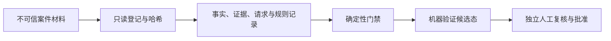

# labor-arbitration-skill

[](https://github.com/f12336414-ship-it/labor-arbitration-skill/actions/workflows/test.yml)
[](https://github.com/f12336414-ship-it/labor-arbitration-skill/actions/workflows/codeql.yml)
[](LICENSE)

一个面向中国劳动仲裁材料整理的 Codex Skill 参考实现。它把原始文件登记、事实与证据追踪、法律来源验证、金额计算输入和输出状态提升拆成可审计步骤，并用确定性脚本阻止不完整材料被误标成“可提交”。

当前版本只支持“北京、单机、单用户、人工复核”的受限场景。它不是律师、法律服务、证据鉴定工具，也不保证仲裁受理、证据采信或案件结果。

## 核心能力

- 只读登记本地材料，计算 SHA-256，并明确“完整性不等于真实性”；
- 分离用户陈述、材料提取、证据关联和仲裁庭认定；
- 分离官方发布者身份与规范性文件的法律效力；
- 对时效、请求权冲突、用人单位控制证据和计算假设设置结构化门禁；
- 将自动化上限限制为 `MACHINE_VALIDATED_CANDIDATE`；
- 拒绝模型自我完成法律核验、隐私审查、P0/P1 处置或人工批准。

## 快速开始

要求 Python 3.10 或更高版本，无第三方运行时依赖。

```powershell
git clone https://github.com/f12336414-ship-it/labor-arbitration-skill.git
cd labor-arbitration-skill/labor-arbitration-skill
python -m unittest discover -s tests -v
```

将 `labor-arbitration-skill` 子目录复制或链接到个人 Codex skills 目录，然后在 Codex 中显式调用 `$labor-arbitration-skill`。

登记原始材料时，输出必须位于材料目录之外：

```powershell
python scripts/build_intake_manifest.py <材料目录> --output <manifest.json>
```

验证结构化案件包：

```powershell
python scripts/validate_case_package.py <case-package.json> --intake-manifest <manifest.json>
```

退出码为 `0` 表示请求状态通过；`2` 表示格式正确但门禁阻止提升；`1` 表示输入损坏、超限或解析失败。

案件包的基础结构见 [JSON Schema](labor-arbitration-skill/references/case-package.schema.json)。[合成草稿示例](examples/synthetic-draft.json)仅演示最低草稿状态，不代表机器验证候选态。

## 可靠性边界



哈希仅证明脚本读取到的字节，不能证明材料真实性。当前审批记录能绑定案件快照，但不能密码学证明审批人身份；托管部署必须接入独立认证或签名审批通道。真实案件数据不应提交到本仓库、Issue、Pull Request 或 CI 日志。

完整约束见 [可靠性契约](labor-arbitration-skill/references/reliability-contract.md)、[审核报告](docs/audit-report.md)和[威胁模型](docs/threat-model.md)。

## 开源与贡献

本项目采用 [Apache License 2.0](LICENSE)。提交贡献前请阅读 [CONTRIBUTING.md](CONTRIBUTING.md)、[SECURITY.md](SECURITY.md) 和 [CODE_OF_CONDUCT.md](CODE_OF_CONDUCT.md)。只允许使用合成测试数据；不要提交真实姓名、身份证号、联系方式、工资记录、聊天记录或其他案件材料。
